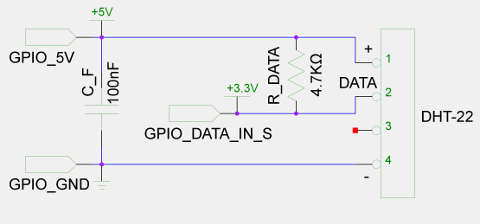
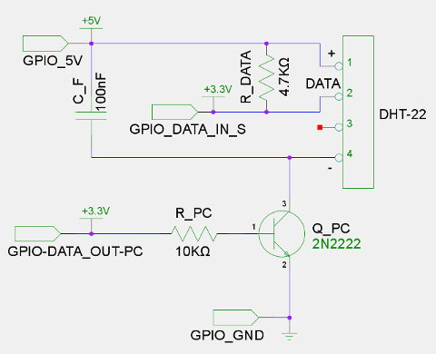

### raspberrypi-dht22
### Temperature/Humidity monitoring using Raspberry + DHT22 Sensor with programmable power control.


## 

Read Sensor metrics, output to stdout (CSV format) and optionally post them to ThingSpeak.<br/>
Logs to syslog but if there is an error it will also start logging to stderr.<br/>
Since this is intended to be called from cron if there are messages to stderr an e-mail alert will be generated.<br/>
That way if an e-mail alert is send (only upon errors) we will receive all logs send to stderr, including the final success status if any.

**Power Control**.<br/>
An additional GPIO port can be used to control the power of the sensor.<br/>
This is optional but it solves an occasional issue with this sensor. Sometimes the sensor returns Nan values until it is powered off and on again. Restarting Raspberry won’t help in this case since the 5V GPIO pin will remain on during the power cycle.

# <br/>
Load options from the first yaml file found ```(dht22.yml, /usr/local/etc/dht22.yml)```.<br/>

## Installation
- Tested on Raspbian Buster version: February 2020, release date: 2020-02-13.
- Requires Python 3.6 or higher.

**Deploy with  or follow the below steps.**

Install additional debian packages.
```sh
$ apt-get install python3-pip python3-setuptools python3-urllib3 python3-yaml python3-rpi.gpio
```

Install Adafruit-DHT.
```sh
$ pip3 install --user Adafruit-DHT
```

Copy script ```/usr/local/bin/dht22.py``` and config file  ```/usr/local/etc/dht22.yml```.

Create directory for csv files.
```sh
$ mkdir /var/local/dht22
```

Crontab entry that runs the script every 10 minutes and appends stdout to a monthly file:
```
*/10 * * * * : Weather_Metrics ; /usr/local/bin/dht22.py 1>>/var/local/dht22/$(/bin/date +\%Y\%m).csv
```

If Power control port is used:<br/>
Optionally add a cron job that will power on the sensor on boot.
```
@reboot /usr/bin/gpio -g mode <GPIO_Powerctl_Port> output && /usr/bin/gpio -g write <GPIO_Powerctl_Port> 1
```
Otherwise the script will power on the sensor upon first run but in this case expect a delay on the first run.

## 
Created with ```gEDA```

# Basic circuit


# Circuit with Power Control


| Symbol | Description |
| ------ | ----------- |
| GPIO_5V | +5V GPIO pin |
| GPIO_DATA_IN_S | GPIO data pin to read sensor |
| GPIO_DATA_OUT_PC | GPIO data pin for power control |
| GPIO_GND | Ground GPIO pin |
| R_DATA | Pull-up resistor for data pin |
| C_F | Small capacitor for noise filtering (Optional) |
| Q_PC | Transistor for Power control |
| R_PC | Resistor to limit base current of Q_PC transistor |

